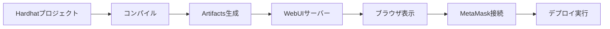

# 独立WebUI方式 マルチプロジェクト管理構成

## ディレクトリ構造

```
siegeNgin/
├── projects/              # 管理対象のHardhatプロジェクト群
│   ├── project1/         # プロジェクト例1
│   │   ├── contracts/    # スマートコントラクト
│   │   ├── scripts/      # デプロイスクリプト
│   │   ├── tests/        # テストファイル
│   │   ├── hardhat.config.js
│   │   └── package.json
│   └── project2/         # プロジェクト例2
│       ├── contracts/
│       ├── scripts/
│       ├── tests/
│       ├── hardhat.config.js
│       └── package.json
├── browser-deploy/        # 独立WebUI（プロジェクト管理ツール）
│   ├── index.html        # メインUI
│   ├── js/
│   │   ├── app.js       # メインアプリケーションロジック
│   │   ├── projects.js  # プロジェクト管理機能
│   │   ├── deploy.js    # デプロイ機能
│   │   ├── interact.js  # コントラクト操作機能
│   │   └── utils.js     # ユーティリティ関数
│   ├── css/
│   │   └── style.css    # スタイル（Tailwind CDN使用）
│   └── server.js        # Express サーバー
└── docs/                 # ドキュメント

```

## 実装順序

### Phase 1: 基盤構築（今週）
1. **Hardhat環境の最小構成**
   - hardhat.config.js
   - 基本的なnpm scripts

2. **サンプルコントラクト**
   ```solidity
   // contracts/SimpleStorage.sol
   contract SimpleStorage {
       uint256 public value;
       
       function setValue(uint256 _value) public {
           value = _value;
       }
   }
   ```

3. **基本的なWebサーバー**
   ```javascript
   // browser-deploy/server.js
   const express = require('express');
   const path = require('path');
   const fs = require('fs').promises;
   
   const app = express();
   app.use(express.static(__dirname));
   app.use(express.json());
   
   // プロジェクト一覧取得
   app.get('/api/projects', async (req, res) => {
       const projectsDir = path.join(__dirname, '../projects');
       const projects = await fs.readdir(projectsDir);
       res.json({ projects });
   });
   
   // 特定プロジェクトのコントラクト一覧
   app.get('/api/projects/:projectName/contracts', async (req, res) => {
       const { projectName } = req.params;
       const projectPath = path.join(__dirname, '../projects', projectName);
       
       // Hardhatを動的にロード
       const hre = require(path.join(projectPath, 'hardhat.config.js'));
       
       // コントラクト一覧を返す
   });
   
   // プロジェクトのコンパイル実行
   app.post('/api/projects/:projectName/compile', async (req, res) => {
       const { projectName } = req.params;
       // プロジェクト切り替えてコンパイル
   });
   ```

4. **シンプルなHTML UI**
   - プロジェクト選択ドロップダウン
   - MetaMask接続ボタン
   - 選択プロジェクトのコントラクト一覧
   - デプロイボタン
   - 結果表示エリア（アドレス、ABI）

## 開発フロー



## スクリプト設定

```json
// package.json
{
  "scripts": {
    "compile": "hardhat compile",
    "ui": "node browser-deploy/server.js",
    "dev": "npm run compile && npm run ui"
  }
}
```

## 技術選定の理由

### なぜExpress？
- シンプルで軽量
- 静的ファイルの配信が簡単
- APIエンドポイントの追加が容易

### なぜVanilla JS？
- 依存関係を最小限に
- デバッグが容易
- 後からフレームワーク化も可能

### なぜTailwind CDN？
- ビルドプロセス不要
- プロトタイピングに最適
- 見た目を素早く整えられる

## マルチプロジェクト管理の利点

1. **統一されたUI**: 全プロジェクトを一つのインターフェースで管理
2. **プロジェクト切り替え**: ドロップダウンで簡単に切り替え
3. **比較検証**: 複数プロジェクトのコントラクトを並行してテスト
4. **効率的な開発**: プロジェクトごとにターミナルを開く必要なし

## UI フロー

```
1. ブラウザでlocalhost:3000を開く
2. プロジェクト選択（ドロップダウン）
3. "Compile"ボタンでコンパイル
4. コントラクト一覧から選択
5. MetaMaskで接続
6. "Deploy"でデプロイ実行
7. 結果（アドレス、ABI）を表示・コピー
```

## 次のステップ

1. プロジェクトディレクトリ構造を作成
2. サンプルプロジェクト（project1）を作成
3. 基本的なserver.jsを実装
4. プロジェクト選択機能付きHTMLを作成

これでマルチプロジェクト管理の土台ができます。