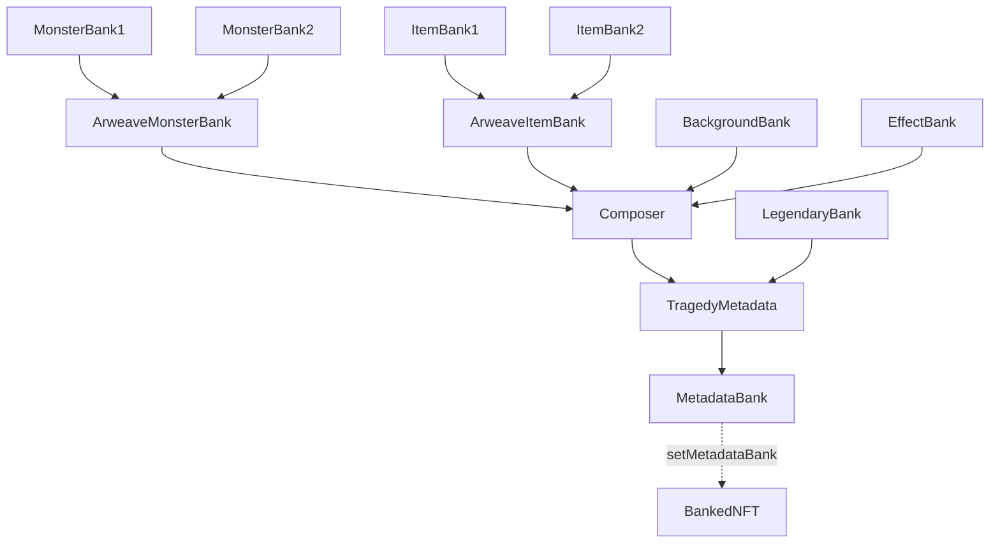

# Tragedy NFT Project

A sophisticated on-chain SVG composition NFT project with a 6-layer architecture.

## Overview

Tragedy is an NFT collection that generates unique artwork by composing multiple SVG layers on-chain. Each NFT combines:
- Monster silhouettes
- Items
- Backgrounds
- Visual effects
- Legendary titles (for special token IDs)

## Architecture

### Layer Structure

```
Layer 1: Base Data Banks (Storage)
├── ArweaveMonsterBank1/2    - Monster SVG data (split for gas optimization)
├── ArweaveItemBank1/2       - Item SVG data (split for gas optimization)
├── ArweaveBackgroundBank    - Background URL data
├── ArweaveEffectBank        - Effect URL data
└── LegendaryBank           - Special titles and descriptions

Layer 2: Aggregator Banks (Data Integration)
├── ArweaveMonsterBank      - Routes to MonsterBank1/2 based on ID
└── ArweaveItemBank         - Routes to ItemBank1/2 based on ID

Layer 3: Composer (SVG Assembly)
└── ArweaveTragedyComposer  - Combines all layers with color filters

Layer 4: Metadata Generator
└── TragedyMetadata         - Generates NFT metadata JSON with synergies

Layer 5: Proxy Contract
└── MetadataBank           - Proxy to TragedyMetadata

Layer 6: NFT Contract
└── BankedNFT              - ERC721 NFT with royalties and SBT support
```

### Why This Architecture?

1. **Gas Optimization**
   - Large SVG data is split across multiple contracts
   - Avoids hitting contract size limits
   - Enables efficient on-chain storage

2. **Modularity**
   - Each layer can be updated independently
   - New content can be added without redeploying everything
   - Clear separation of concerns

3. **Flexibility**
   - Composer handles visual assembly logic
   - Metadata manages attributes and synergy calculations
   - Easy to extend with new features

## Contract Dependencies



## Deployment

This project uses siegeNgin's complex deployment system. The deployment is configured in `deploy-config.json`.

### Deployment Steps

1. **Step 1**: Deploy 7 base banks in parallel (~30 seconds)
2. **Step 2**: Deploy 2 aggregator banks with bank addresses
3. **Step 3**: Deploy composer with all 4 bank addresses
4. **Step 4**: Deploy metadata generator with composer and legendary bank
5. **Step 5**: Deploy metadata proxy
6. **Step 6**: Deploy NFT contract and configure metadata bank

### To Deploy

1. Connect your wallet in siegeNgin
2. Select the "tragedy" project
3. Click "Compile" to build all contracts
4. The UI will detect the complex deployment configuration
5. Click "Start Deployment Process"
6. Monitor progress as each step completes
7. Save the deployed addresses from the summary

## Features

### On-Chain SVG Composition
- Monsters, items, backgrounds, and effects are combined dynamically
- Each combination creates a unique visual
- No external dependencies or IPFS

### Synergy System
- Certain monster + item combinations unlock special bonuses
- Synergies are calculated on-chain
- Affects rarity and attributes

### Legendary Tokens
- Special token IDs (666, 6666, etc.) have unique titles
- Custom descriptions for legendary pieces
- Enhanced visual effects

### Soul Bound Token (SBT) Support
- Optional SBT mode prevents transfers
- Configurable per token
- Maintains standard ERC721 compatibility

### Royalty Support
- ERC2981 royalty standard
- Configurable royalty percentage
- Automatic royalty distribution

## Contract Interactions

### Minting
```solidity
// Public mint with fee
bankedNFT.publicMint{value: mintFee}(species, background, item, effect);

// Check mint fee
uint256 fee = bankedNFT.mintFee();
```

### Viewing Metadata
```solidity
// Get token URI (returns data URI with JSON)
string memory uri = bankedNFT.tokenURI(tokenId);

// Get token attributes
(uint8 species, uint8 background, uint8 item, uint8 effect) = bankedNFT.getTokenAttributes(tokenId);
```

### Soul Bound Tokens
```solidity
// Set token as soul bound (owner only)
bankedNFT.setSoulBound(tokenId, true);

// Check if token is soul bound
bool isSBT = bankedNFT.isSoulBound(tokenId);
```

## Gas Costs (Estimates)

- Deployment: ~50M gas total (all contracts)
- Minting: ~250k gas per NFT
- Metadata generation: ~500k gas (view function)

## Technical Details

- Solidity version: 0.8.20
- OpenZeppelin: v5.0.0
- Uses viaIR optimizer for stack depth management
- Hardhat for development and testing

## Development

### Prerequisites
```bash
npm install
```

### Compile
```bash
npx hardhat compile
```

### Test
```bash
npx hardhat test
```

## Security Considerations

- All contracts are ownable with access controls
- Mint parameters are validated to prevent invalid combinations
- Soul bound tokens cannot be transferred once set
- Royalty recipient can only be changed by owner

## Future Enhancements

- Additional monster and item types
- Dynamic backgrounds based on blockchain data
- Collaboration features between NFT holders
- On-chain evolution system